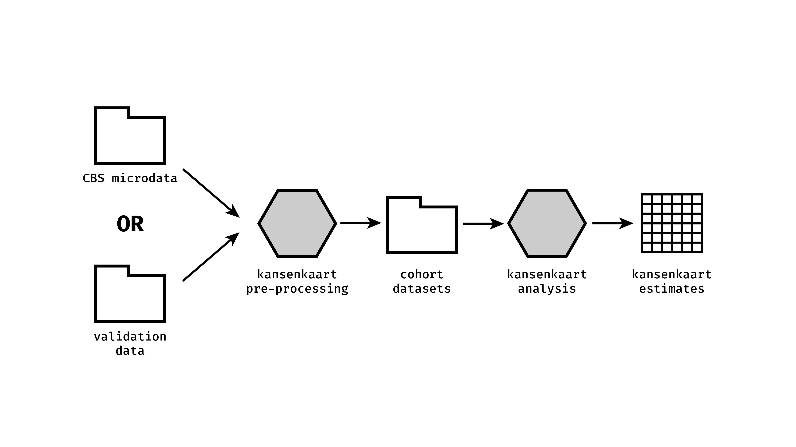

# KansenKaart preprocessing
*Pipeline to create cohorts for the KansenKaart project*



A reproducible preprocessing pipeline for the [KansenKaart]( https://kansenkaart.nl/) project. The input is raw microdata from CBS (or a synthetic test-version from our repository [cbs_validationdata](https://github.com/sodascience/cbs_validationdata)). The output is several tidy, cleaned-up cohort datasets. The cohort datasets serve as the input to the [kansenkaart analysis](https://github.com/sodascience/kansenkaart_analysis).

## What is KansenKaart?
[KansenKaart]( https://kansenkaart.nl/) is a project on intergenerational mobility across areas in the Netherlands. The goal is to show how circumstances in which Dutch individuals grew up are related to later-in-life outcomes. 

We begin by measuring the average later-life outcomes (e.g., income) of children for each neighborhood, by demographic subgroups (gender and migration background), and socioeconomic status (parental income). We focus on municipalities, neighborhoods, and postal codes where children grew up, regardless of where they live later in life. We then map these geographical differences in later-life outcomes across areas within the Netherlands. These final results are now available on the interactive website [KansenKaart.nl](https://kansenkaart.nl/), which includes outcomes ranging from health, education, to economic productivity. 

So far, we have a total of 34 outcomes derived from five cohorts. These five cohorts are created using this repository. More detailed information on the cohorts can be found [here](https://github.com/sodascience/kansenkaart_preprocessing/blob/cbs_updated/COHORTS.md). The final estimates of these 34 outcomes are created using the repository [kansenkaart analysis](https://github.com/sodascience/kansenkaart_analysis).

## Installation
- Clone this repository to a folder on your machine
- Unzip the latest version of the built CBS data into the `/cbsdata` folder from [here](https://github.com/sodascience/cbs_validationdata/releases) OR edit the file locations in the `config` files to point to the right files.
- Open the `.Rproj` file, install the `renv` package
- Run `renv::restore()` to install the right versions of all dependencies

## Cohort creation/ usage
The cohort datasets are created using the file `create_cohort_data.R`. At the top of this file, change the desired input configuration to one of the following:
- `config/main.yml`
- `config/perinatal.yml`
- `config/high_school.yml`
- `config/elementary_school.yml`

After this change, run the entire file to create the cohort dataset in the scratch folder!

The cohort dataset for the child mortality cohort is created using the file ‘create_cohort_data_mortality.R’, which already contains the desired input configuration `config/child_mortality.yml`. After running the entire file, the created cohort dataset can be found in the scratch folder. 


# Details

## Configuration
Several cohorts can be created using this repository, from the raw microdata files at CBS. The configuration files for each of these cohorts can be found in the [`config`](./config) folder. Several selections and/or date values can also be changed there.

## Preparation pipeline
The data preparation pipeline has four components:

1. Cohort creation
    - Selecting the cohort based on filtering criteria. 
    - Adding parent information to the cohort.
    - Adding postal code and region information to the cohort.
    - Writing `01_cohort.rds` to the scratch folder.
2. Predictor creation
    - Adding parent income and income percentile to the cohort.
    - Adding migration background information to the cohort.
    - Writing `02_predictor.rds` to the scratch folder.
3. Outcome creation
    - Adding outcomes of children to the cohort.
    - Writing `03_outcomes.rds` to the scratch folder.
4. Post-processing
    - Selecting variables of interest.
    - Writing `kansenkaart_data.rds` to the scratch folder.

More detailed information on these four components can be found [here]( https://github.com/sodascience/kansenkaart_preprocessing/blob/cbs_updated/ COMPONENTS.md)

## Package management
The CBS server has specific versions of packages. A package version dump is available in the `resources` folder. For package management, we use `renv`. This ensures the same versions are installed as in CBS.

To use a new package, install it using `install.packages()`, and then run the file `resources/set_cbs_versions.R`. This will ensure that your package exists at CBS (it will warn & remove if it does not) and also that the package is at the right version.

## License and citation

The `KansenKaart preprocessing` pipeline is published under the MIT license. When using for academic work, please cite:

```
Citation for the KansenKaart preprocessing
```

## Contact
This project is developed and maintained by the [ODISSEI Social Data Science
(SoDa)](https://odissei-data.nl/nl/soda/) team.

Do you have questions, suggestions, or remarks? File an issue in the issue
tracker or feel free to contact [Erik-Jan van
Kesteren](https://github.com/vankesteren)
([@ejvankesteren](https://twitter.com/ejvankesteren)) or [Helen Lam](https://github.com/Helenlam20).
